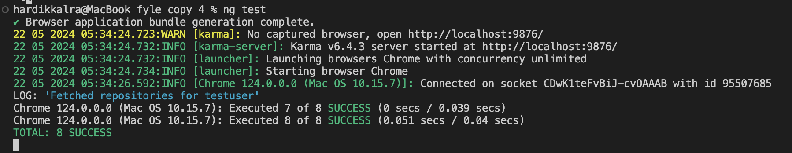

<h2 align="center">
Github Repositories listing Page
</h2>
<h3 align="center" >
Fyle Internship Challenge
</h3>
<h4 align="center" style="color:gray">
⇩  Webpage preview  ⇩
</h4>

<h3><u>
To run the app globally</u></h3>

<h4 style="font-size:12px">Click on this link - https://fyleassignment-five.vercel.app/search</h4>

<h3><u>To run the app locally on your machine</u></h3>

<h4 style="font-size:12px">Follow these steps -</h4>

<li style="font-size:12px">Copy the repository URL.</li>
<li style="font-size:12px">Open terminal and navigate to the folder where you want to download the project on you local machine. (like cd desktop)
</li>
<li style="font-size:12px">Type command- <b>git clone -copied url- </b>on terminal
</li>
<li style="font-size:12px">or type command- <b>git clone https://github.com/hkalra0077/fyleassignment.git </b> on terminal
</li>
<li style="font-size:12px">Ensure that you have npm, node, angular intalled on your system
</li>
<li style="font-size:12px">if latest version of node is not able to support angular then install the LTS version of node on your system
</li>
<li style="font-size:12px">open the project on VS code and open terminal
</li>
<li style="font-size:12px">run 'npm intall' to install ann necessary modules required
</li>
<li style="font-size:12px">now run 'ng serve' to start the dev server locally and which can be accessed by navigating to http://localhost:4200/</li>

<h3><u>Unit Tests and Code Coverage</u></h3>

<h4 style="font-size:12px">Added <u>unit test cases</u> 1 for component - search and 1 for service - api</h4>

<h4 style="font-size:12px">For running test cases</h4>

<li style="font-size:12px">Open terminal</li>
<li style="font-size:12px">run 'ng test' to run the test cases</li>
 

<h4 align="center" style="color:gray">
⇩  Test case preview  ⇩
</h4>

<h3> </h3>

<h4 style="font-size:12px">To check code coverage</h4>

<li style="font-size:12px">In terminal run 'ng test --code-coverage'</li>
<li style="font-size:12px">A folder named 'coverage' will get created</li>
<li style="font-size:12px">Inside that folder navigate to index.html and open its file location</li>
<li style="font-size:12px">Now open that file to get the code coverage</li>

<h4 align="center" style="color:gray">
⇩  Code coverage preview  ⇩
</h4>

<h3> </h3>
<h4 align="right" style="font-size:12px; color:gray"><i>made by- Hardik kalra</h4>
